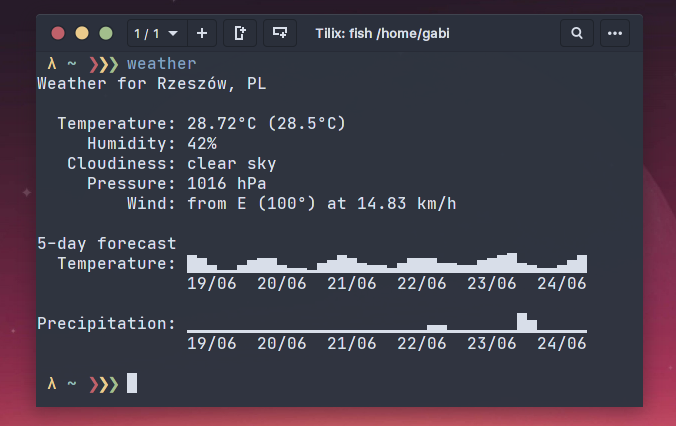

# rust-weather
HEAVILY INSPIRED from https://github.com/oh-my-fish/plugin-weather.

Standalone weather app. You can use it without fish shell.




### Requirements:

- rust (for self compiling/building)
- OpenWeather api key: https://openweathermap.org/appid

### Supported language:

- pl
- en

### Supported units:

- metric

### Config:

Create config.json file in you home directory ~/.config/rust-weather/config.json

```fish
cat .config/rust-weather/config.json 
───────┬───────────────────────────────────────────────────────────────────────────────────────────────────────────────────────────────────────────────────────────────────────────────────────
       │ File: .config/rust-weather/config.json
───────┼───────────────────────────────────────────────────────────────────────────────────────────────────────────────────────────────────────────────────────────────────────────────────────
   1   │ {
   2   │   "api_key" : "your api key",
   3   │   "lang" : "en",
   4   │   "units" : "metric",
   5   │   "latitude" : 50.029468,
   6   │   "longitude" : 22.013083 
   7   │   
   8   │ }
───────┴───────────────────────────────────────────────────────────────────────────────────────────────────────────────────────────────────────────────────────────────────────────────────────

```

### Clone, build, run (linux)
```fish
git clone git@github.com:wojciech-zurek/rust-weather.git

cd rust-weather

RUSTFLAGS="-C target-cpu=native" cargo build --release

sudo cp target/release/rust-weather /bin/weather

mkdir -p ~/.config/rust-weather

echo '{
  "api_key" : "you api key",
  "lang" : "en",
  "units" : "metric",
  "latitude" : 50.029468,
  "longitude" : 22.013083 
 }' > ~/.config/rust-weather/config.json
```

### Usage:
```fish
 λ ~ ❯❯❯ weather
Weather for Rzeszów, PL

  Temperature: 24.49°C (24.46°C)
     Humidity: 56%
   Cloudiness: moderate rain
     Pressure: 1004 hPa
         Wind: from ENE (71°) at 3.20 km/h gusting to 12.89 km/h

5-day forecast
  Temperature: ▅▄▂▁▃▅▆▆▃▂▂▁▄▅▇▆▄▃▃▂▄▆▆▆▄▄▃▃▅▆▇█▄▃▂▂▃▅▇▇
               19/06  20/06  21/06  22/06  23/06  24/06  

Precipitation: ▁▁▁▁▁▁▁▁▁▁▁▁▁▁▁▁▁▁▁▁▁▁▁▃▄▁▁▁▁▁▁▁█▅▁▁▁▁▁▁
               19/06  20/06  21/06  22/06  23/06  24/06  

```

### Todo
- MUCH better error handling,
- support other units,
- cache results,
- use args from command line,
- support query by city name (maybe).
